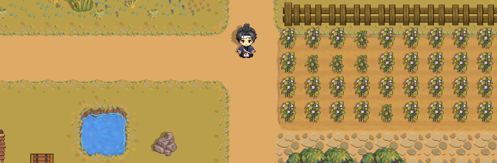
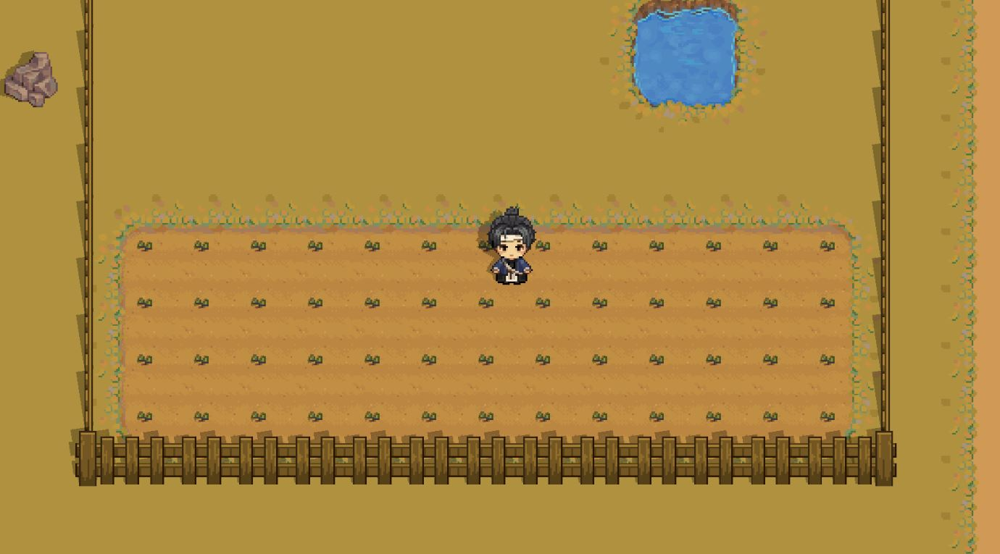
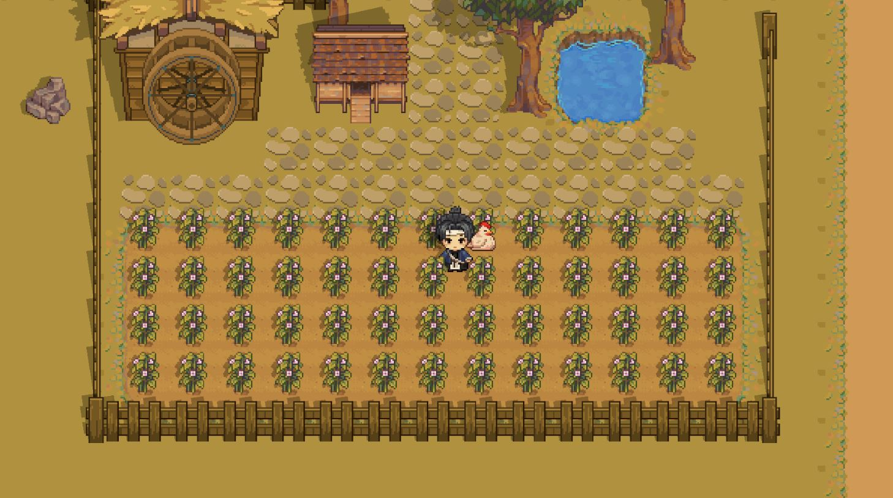
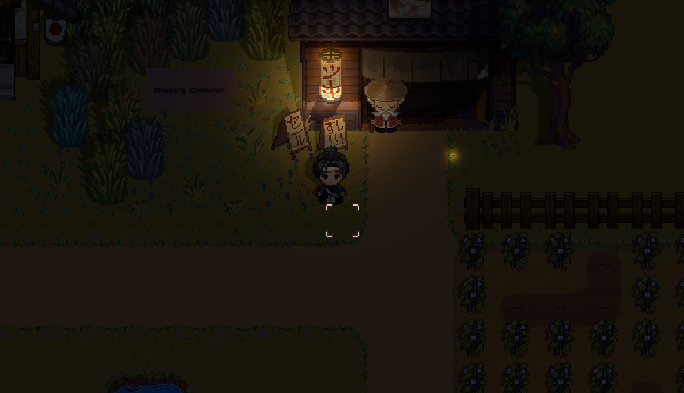
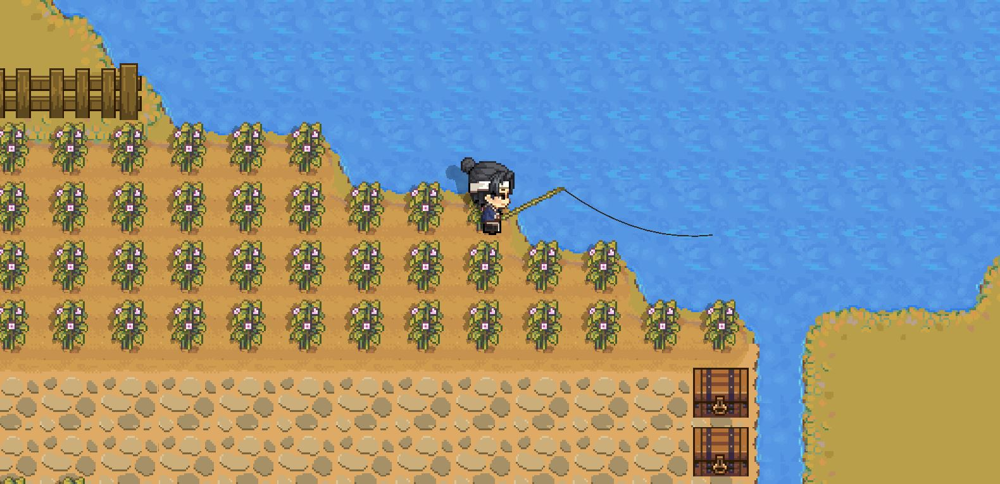
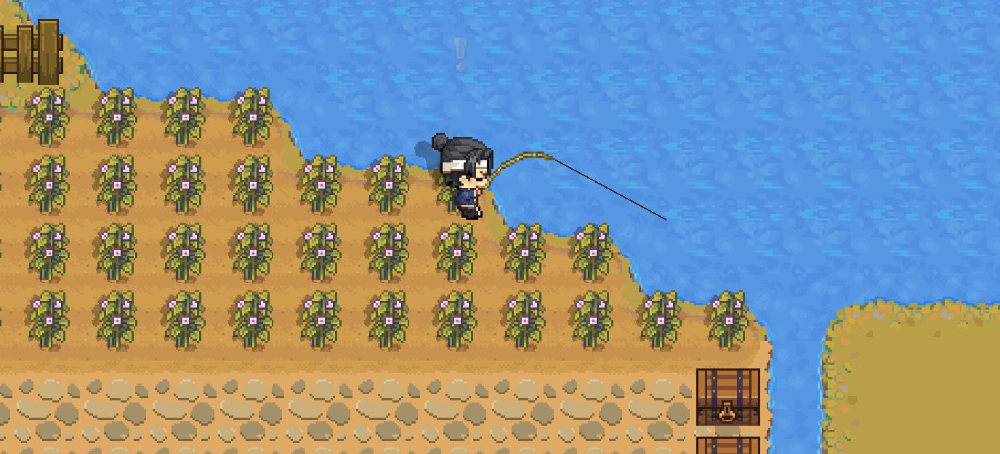
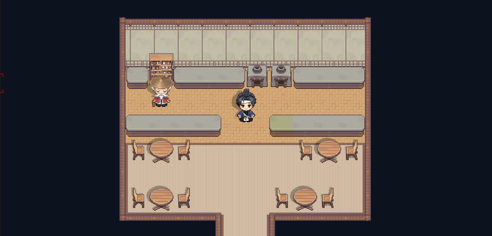

# 🦊 Inari's Kitchen

  

  <em>A cozy restaurant simulation game where cooking meets storytelling</em>

  
  
  

---

## 🍜 About the Game

**Inari's Kitchen** is a heartwarming restaurant simulation game developed by **Sleepyhead Studio**. Step into the shoes of a budding chef running your own cozy kitchen, where every dish tells a story and every customer has a tale to share.

### 🎮 Features

- **🍳 Cook Delicious Dishes** - Master a variety of recipes with an intuitive cooking system
- **👥 Meet Unique Characters** - Build relationships with quirky NPCs who visit your restaurant
- **📅 Dynamic Schedules** - NPCs have their own lives, routines, and seasonal behaviors
- **⭐ Quality Matters** - Your cooking skills affect dish quality and customer satisfaction
- **🏠 Build Your Dream Restaurant** - Customize and expand your kitchen as you grow
- **📖 Discover Stories** - Uncover narrative threads through conversations and events

---

## 📸 Screenshots

### 🌱 Plant Growth

_Grow your own ingredients and watch them flourish through the seasons_

  
  

### 🌅 Day & Night Cycle

_Experience the charm of your restaurant from dawn to dusk_

  
  

### 🎣 Fishing

_Take a break and catch fresh ingredients at the nearby waters_

  
  

### 🏠 Restaurant Customization

_Design and personalize your dream kitchen_

  

---

## 🎬 Gameplay Preview

<!-- Add a GIF or link to trailer here -->

_Coming soon!_

---

## 🛠️ Development

Inari's Kitchen is being developed with:

- **Engine:** Unity
- **Art Style:** 2D Pixel Art with modern lighting
- **Narrative:** Ink integration for dynamic dialogue

## 📬 Stay Connected

- **Developer:** Sleepyhead Studio
  <!-- Add your links below -->
  <!-- - **Twitter:** [@YourHandle](https://twitter.com/yourhandle) -->
  <!-- - **Discord:** [Join our community](https://discord.gg/yourserver) -->
  <!-- - **Website:** [www.yoursite.com](https://www.yoursite.com) -->

---

## 📄 License

© 2026 Sleepyhead Studio. All Rights Reserved.

This repository is for showcase purposes only. All game assets, code, and content are proprietary.

---

  <strong>Made with 💜 by Sleepyhead Studio</strong>

